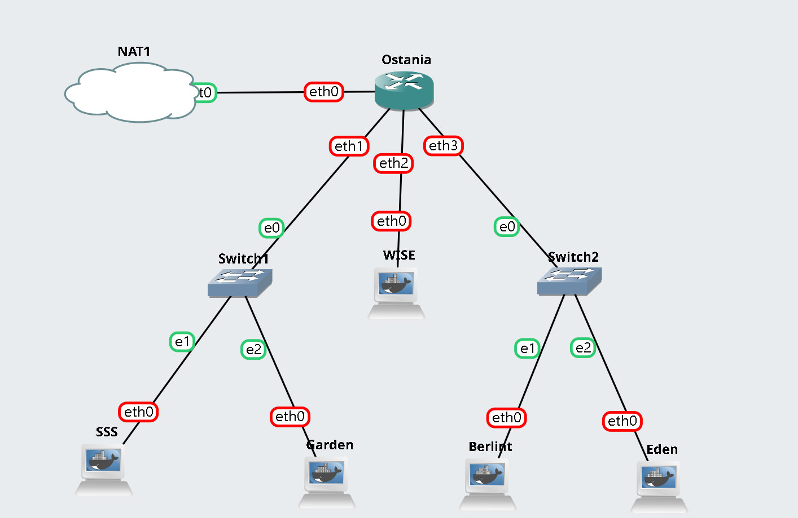
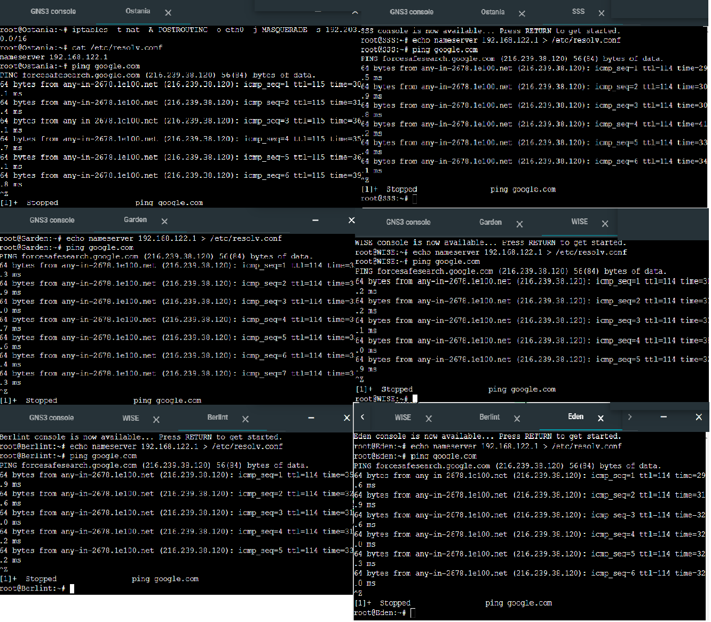
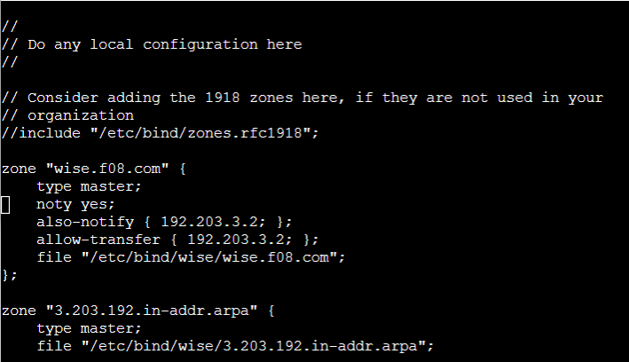
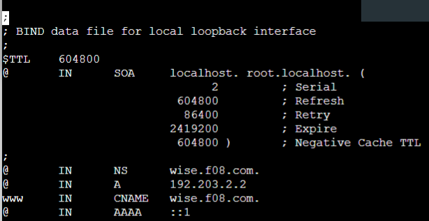
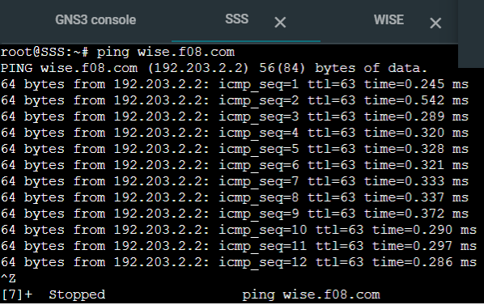
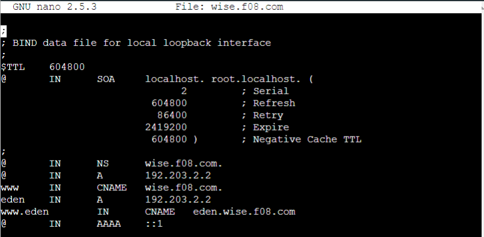
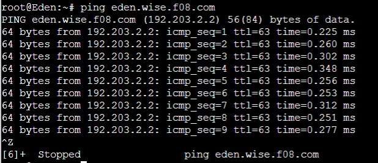

# Jarkom-Modul-2-F08-2022
David Fischer Simanjuntak - 5025201123 <br/>
Nabila Zakiyah Khansa Machrus	- 5025201139 <br/>
Muhammad Rolanov Wowor - 5025201017 <br/>

## Laporan Resmi Modul 2 F08 2022

### **Soal 1**
WISE akan dijadikan sebagai DNS Master, Berlint akan dijadikan DNS Slave, dan Eden akan digunakan sebagai Web Server. Terdapat 2 Client yaitu SSS, dan Garden. Semua node terhubung pada router Ostania, sehingga dapat mengakses internet 

### **Jawaban**

IP :

    IP DNS: 192.168.122.1
    
CONFIG SSS :

      uto eth0
      iface eth0 inet static
      address 192.203.1.2
      netmask 255.255.255.0
      gateway 192.203.1.1
      
 CONFIG Garden :
 
      auto eth0
      iface eth0 inet static
      address 192.203.1.3
      netmask 255.255.255.0
      gateway 192.203.1.1
      
 CONFIG WISE :
 
      auto eth0
      iface eth0 inet static
      address 192.203.2.2
      netmask 255.255.255.0
      gateway 192.203.2.1
      
CONFIG Berlint: 

      auto eth0
      iface eth0 inet static
      address 192.203.3.2
      netmask 255.255.255.0
      gateway 192.203.3.1
      
CONFIG Eden :

      auto eth0
      iface eth0 inet static
      address 192.203.3.3
      netmask 255.255.255.0
      gateway 192.203.3.1


semua node bisa melakukan ping ke google yang artinya semua node sudah tersambung ke internet.

### **Soal 2**
Untuk mempermudah mendapatkan informasi mengenai misi dari Handler, bantulah Loid membuat website utama dengan akses wise.yyy.com dengan alias www.wise.yyy.com pada folder wise

### **Jawaban**

Langkah pertama ialah melakukan instalasi bind 9 terlebih dahulu

        apt-get update
        apt-get install bind9 -y
        
Kemudian membuat domain dengan command <code> nano /etc/bind/named.conf.local </code>   dan melakukan konfigurasi sebagai berikut <br>
         
         
Setelah itu buat folder baru bernama wise: <code> mkdir /etc/bind/wise </code>, selanjutnya membuat konfigurasi dari wise.f08.com. Pertama-tama adalah menyalin konfigurasi dari db.local : <code> cp /etc/bind/db.local /etc/bind/wise/wise.f08.com </code>. Saat dibuka, konfigurasi yang perlu diubah adalah localhost menjadi wise.f08.com, kemudian mengarahkan ke IP wise yaitu <code> 192.203.2.2 </code>, selanjutnya melakukan restart bind dengan command <code> service bind9 restart </code> lalu menambah konfigurasi CNAME untuk alias www.wise.f08.com, sehingga hasil akhir konfigurasi dari file wise.f08.com menjadi sebagai berikut:<br>
 </br>

Lalu untuk hasil pengetesannya kami mencoba client SSS untuk mengakses wise.f08.com dengan <code> ping wise.f08.com </code> dan hasilnya sebagai berikut:<br>


### **Soal 3**
Setelah itu ia juga ingin membuat subdomain eden.wise.yyy.com dengan alias www.eden.wise.yyy.com yang diatur DNS-nya di WISE dan mengarah ke Eden

Pembuatan subdomain hanya perlu menambahkan konfigurasi pada file <code> /etc/bind/wise/wise.f08.com </code> yaitu <br>
```
    eden    IN      A       192.203.2.2 // IP Wise
    www.eden        IN      CNAME   eden.wise.f08.com // Subdomain eden
```
</br>

sehingga hasil konfigurasi file <code> /etc/bind/wise/wise.f08.com </code> sebagai berikut: <br>
</br>

Kemudian kami mencoba pengetesan dengan Eden mengakses subdomain dengan <code> ping eden.wise.f08.com </code>:<br>



### **Soal 4**
Buat juga reverse domain untuk domain utama

### **Soal 5**
Agar dapat tetap dihubungi jika server WISE bermasalah, buatlah juga Berlint sebagai DNS Slave untuk domain utama

### **Soal 6**
Karena banyak informasi dari Handler, buatlah subdomain yang khusus untuk operation yaitu operation.wise.yyy.com dengan alias www.operation.wise.yyy.com yang didelegasikan dari WISE ke Berlint dengan IP menuju ke Eden dalam folder operation

### **Soal 7**
Untuk informasi yang lebih spesifik mengenai Operation Strix, buatlah subdomain melalui Berlint dengan akses strix.operation.wise.yyy.com dengan alias www.strix.operation.wise.yyy.com yang mengarah ke Eden

### **Soal 8**
Setelah melakukan konfigurasi server, maka dilakukan konfigurasi Webserver. Pertama dengan webserver www.wise.yyy.com. Pertama, Loid membutuhkan webserver dengan DocumentRoot pada /var/www/wise.yyy.com

### **Soal 9**
Setelah itu, Loid juga membutuhkan agar url www.wise.yyy.com/index.php/home dapat menjadi menjadi www.wise.yyy.com/home

### **Soal 10**
Setelah itu, pada subdomain www.eden.wise.yyy.com, Loid membutuhkan penyimpanan aset yang memiliki DocumentRoot pada /var/www/eden.wise.yyy.com

### **Soal 11**
Akan tetapi, pada folder /public, Loid ingin hanya dapat melakukan directory listing saja 

### **Soal 12**
Tidak hanya itu, Loid juga ingin menyiapkan error file 404.html pada folder /error untuk mengganti error kode pada apache

### **Soal 13**
Loid juga meminta Franky untuk dibuatkan konfigurasi virtual host. Virtual host ini bertujuan untuk dapat mengakses file asset www.eden.wise.yyy.com/public/js menjadi www.eden.wise.yyy.com/js

### **Soal 14**
Loid meminta agar www.strix.operation.wise.yyy.com hanya bisa diakses dengan port 15000 dan port 15500

### **Soal 15**
Dengan autentikasi username Twilight dan password opStrix dan file di /var/www/strix.operation.wise.yyy

### **Soal 16**
Dan setiap kali mengakses IP Eden akan dialihkan secara otomatis ke www.wise.yyy.com

### **Soal 17**
Karena website www.eden.wise.yyy.com semakin banyak pengunjung dan banyak modifikasi sehingga banyak gambar-gambar yang random, maka Loid ingin mengubah request gambar yang memiliki substring “eden” akan diarahkan menuju eden.png. Bantulah Agent Twilight dan Organisasi WISE menjaga perdamaian!
